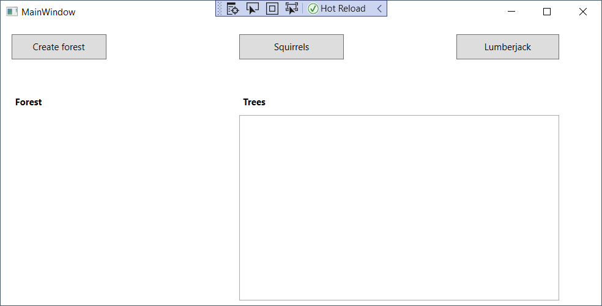
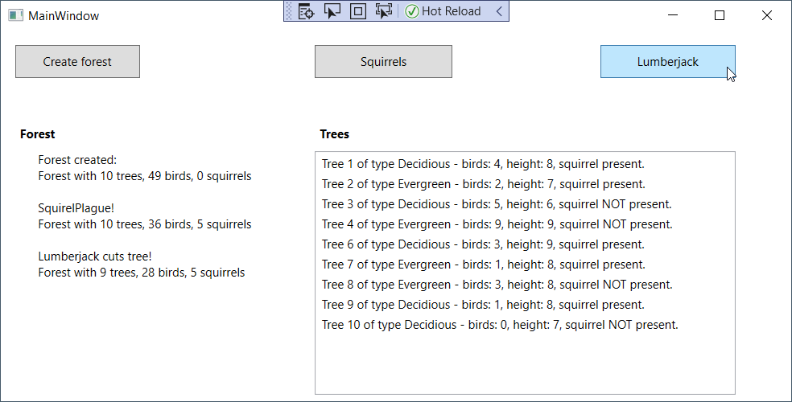

# Monitoraatssessie Programming Basics 2021
## Opzet
De applicatie simuleert een bos met bomen.
Eekhoorns *(Eng.: Squirrel)* en een houthakker *(Eng.: Lumberjack)* zorgen er voor actie: 
- eekhoorns klimmen er in bomen, verjagen er vogels 
- bomen worden geveld door een houthakker.

**Lees de opdracht volledig door vooraleer je begint aan de uitwerking.**

## Startsituatie en knoppen
Je krijgt een leeg WPF Project (.NET Core). De knoppen en controls zijn echter reeds voorzien:



## Uitwerking
### Bos met bomen
Een bos wordt aangemaakt met de knop “Maak bos” (`btnCreateForest`), de lijst (`lstForest`) met bomen wordt gevuld. 

Een boom wordt gekenmerkt door: 
* Een volgnummer: bij aanmaak van de boom wordt een volgnummer meegegeven, dit nummer dient enkel voor visuele aanduiding voor de gebruiker, dus best oplopend (1, 2, 3, ...). 
* Type: loof- of naaldboom *(Eng.: Decidious, Evergreen)*
Dit type wordt per boom willekeurig toegekend.

* Aantal vogels: het aantal vogels dat in de boom zit, een willekeurig tussen 0 en 10. 
* Hoogte: de hoogte van de boom, een willekeurig getal tussen 5 en 10.
* Er wordt per boom bijgehouden of er een eekhoorn in de boom aanwezig is, standaard zit op een boom **geen** eekhoorn.

> **Tip!**
> ```
> // geeft een random nummer van minimum 1 en kleiner dan 11 (dus maximaal 10).
>
> private static Random random = new Random();
> ...
> int randomNumber = random.Next(1, 11);
> ```

### Acties in het bos
In het bos kunnen volgende acties plaatsvinden (klikken op een knop).

* Eekhoornplaag (klikken op `btnSquirrelsClimb`)
  * Elke boom heeft 1 kans op 2 om betreden te worden door een eekhoorn
  * Een boom bevat al of niet een eekhoorn, je hoeft niet bij te houden hoeveel eekhoorns in een boom plaatsnemen 

* Houthakker (klikken op `btnLumberjackCuts`)
  * Een willekeurige boom wordt geveld en verdwijnt uit de lijst, de andere bomen houden hun **originele** volgnummer.
  
 ### Grafische interface
 1. In een een uitgebreid tekstvak (`tblActions)` ziet de gebuiker een chronologisch overzicht van de acties (*Forest created*, *SquirelPlague!* en *Lumberjack cuts tree!*), telkens worden het totaal aantal bomen, vogels en eekhoorns getoond.
 2. De gebruiker ziet ten allen tijde een lijst met de **actuele** gegevens van de  bomen (`lstForest`): type, hoogte, het aantal vogels en het al of niet aanwezig zijn van een eekhoorn.

 

